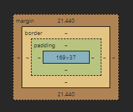

# CSS Box Model

The CSS box model is a concept in CSS that describes how the width and height of an element is calculated. It is composed of four parts: the content area, the padding area, the border area, and the margin area.

- The **content area** is the area inside the element where the actual content is rendered. It is the area that is defined by the `width` and `height` properties of the element.
- The **padding area** is the area between the content area and the border. It is the area that is defined by the `padding` property of the element.
- The **border area** is the area between the padding and the margin. It is the area that is defined by the `border` property of the element.
- The **margin area** is the area outside the border. It is the area that is defined by the `margin` property of the element.

The total width and height of an element is calculated by adding up the widths and heights of the content area, padding area, border area, and margin area.

For example, if an element has a width of 300px, a padding of 20px, a border of 10px, and a margin of 30px, the total width of the element would be 300px + 20px + 10px + 30px = 360px.

The box model can be changed by using the `box-sizing` property. The default value is `content-box`, which calculates the width and height of the element as the content area plus the padding and border areas. The `border-box` value calculates the width and height of the element as the content area only, and the padding and border areas are subtracted from the width and height.

- _To avoid overflow you should always set max-with not absolute width._

- _We use padding because to generate space around an element's content _ 

- _Border by default color set as our text color, but we can overright it. _

- _when we add padding & border the overral width of the box will increse , to avoid that we can use one property (box-sizing: border-box;)._

- _Margin will not affect our inner content. it apply in the outside of the box._

- _for making circle using border radius property, user should must apply width & height._

- _The outline is drawn outside the element's border, and may overlap other content. Also, the outline is NOT a part of the element's dimensions; the element's total width and height is not affected by the width of the outline_.