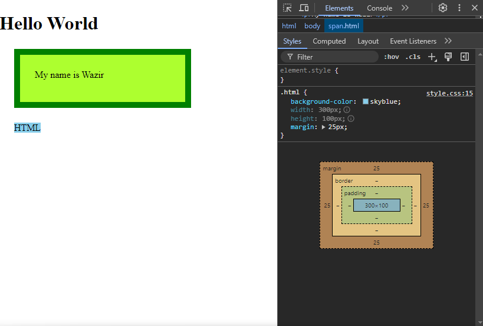

# CSS Box Model with Inline Elements

### What is Inline Element:
>Inline elements are elements that only take up the space of their content and do not force a line break. They are used to wrap a small section of text or an image.
>
>it does not show same behaviour as block element

## Example

### Image



### Code
```CSS
p{
    background-color: greenyellow;
    width: 300px;
    height: 100px;
    padding: 25px;
    box-sizing: border-box;
    border: 10px solid green;
    margin: 25px;
}

.html{
    background-color: skyblue;
    width: 300px;
    height: 100px;
    margin: 25px;
}
```
_Now see the image and code:_

> - `.html` which is a `class` of `span`(an inline element) and is not following Box Model orders.
> - its not following measurments for `height` and `width` as given values:

### ***you can apply ```display: block;``` to make inline element follow the box model order***

```CSS
display:  inline-block;
width: 300px;
height: 100px
```
### Types: Replaced and Non-Replaced Inline Elements

Inline elements can be replaced or non-replaced. Replaced inline elements are those whose content is replaced by an external object such as an image or a plugin. Non-replaced inline elements are those where the content is not replaced by an external object.

#### Replaced Inline Elements

> they follow Box Sizing order, ie `Height` and `Width`

Example of replaced inline elements are:

 ``,`<iframe>`,  `<input>`, `<textarea>`, `<select>`, `<object>`, `<embed>`, `<video>`, `<audio>`

#### Non-Replaced Inline Elements
> they dont follow Box Sizing order, ie `Height` and `Width`

Example of non-replaced inline elements are:

 `<span>`, `<a>`, `<label>`, `<button>`, `<abbr>`, `<cite>`, `<code>`, `<var>`, `<dfn>`, `<kbd>`, `<q>`, `<samp>`, `<sub>`, `<sup>`, `<em>`, `<strong>`, `<mark>`, `<small>`, `<i>`, `<b>`, `<u>`, `

### Conclusion:  
- We use padding because to generate space around an element's content.  
- Border by default color set as our text color, but we can overright it.
- when we add padding & border the overral width of the box will increse , to avoid that we can use one property (box-sizing: border-box;) . 
- Margin will not affect our inner content. it apply in the outside of the box.
- for making circle using border radius property, user should must apply width & height.
- the outline is drawn outside the element's border, and may overlap other content. Also, the outline is NOT a part of the element's dimensions; the element's total width and height is not affected by the width of the outline
- In inline element, width & height doesn't workout. width & height dependend on inner content.  2. if we add padding & border in inline element it's overral height & width increses.
- when padding & border applied to an inline element the top and bottom padding's affect the surrounding elements.
- in inline elements, everything works inline, for top & buttom it doesn't work properly.
- To avoid these type of problem, user should use display: inline-block. 
- There are two types of inline element, one is replaced another is non replaced.

- for replaced elements every property works properly even if the element is inline example -: `<iframe>`, `<video>`, `<embed>`, `` 
- non-replaced elements are as similar as inline elements. examples -: 
`<span>`, `<strong>`, `<i>`, `<b>`, `<em>`
