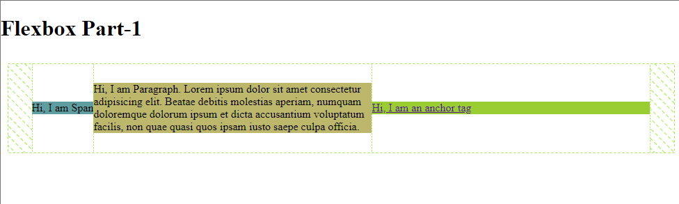
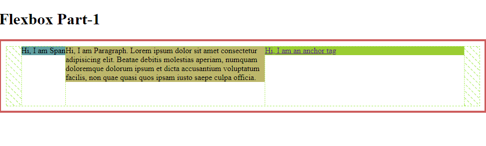

### Flexbox

Flexbox is a layout mode in CSS that makes it easy to create flexible layouts for different screen sizes and devices. It is a powerful tool for creating responsive and flexible layouts.

The main idea behind flexbox is to give the container the ability to change its item's width/height (and order) to best fill the available space (mainly to accommodate to all kinds of display devices and screen sizes). A flex container expands items to fill available free space or shrinks them to prevent overflow.

A flex container is the parent element in which flex items are contained. A flex item is an element that is a child of a flex container.

The main properties and values used in flexbox are:

- `display: flex;` : The container element which contains the flex items.
- `flex-direction: row | column | row-reverse | column-reverse;` : To define the direction of the flex items. Row is the default direction.
- `justify-content: flex-start | center | space-between | space-around;` : To define how the flex items are positioned in the container.
- `flex-wrap: wrap | nowrap;` : To define whether the flex items should wrap to a new line or not.
- `align-items: flex-start | center | stretch;` : To define how the flex items are aligned vertically.
- `align-self: auto | flex-start | center | stretch;` : To define the alignment for an individual flex item.
- `flex-grow: 0 | 1;` : To define how much a flex item should grow relative to the other flex items.
- `flex-shrink: 0 | 1;` : To define how much a flex item should shrink relative to the other flex items.
- `flex-basis: auto | 0 | 100px;` : To define the initial length of a flex item.
- `order: 0 | 1 | 2;` : To define the order of the flex items.

The most common use of flexbox is for creating horizontal or vertical navigation bars, creating responsive image galleries, and creating flexible grid systems.

### Example

The following example demonstrates how to use flexbox to create a horizontal navigation bar:

```HTML
<style>
    .nav {
        display: flex;
        justify-content: space-between;
        list-style: none;
        padding: 0;
        margin: 0;
        background-color: #999;
    }

    .nav li {
        margin-right: 20px;
    }

    .nav a {
        color: #fff;
        text-decoration: none;
    }
</style>

<nav>
    <ul class="nav">
        <li><a href="#">Home</a></li>
        <li><a href="#">About</a></li>
        <li><a href="#">Contact</a></li>
    </ul>
</nav>
```

The following example demonstrates how to use flexbox to create a responsive image gallery:

```HTML
<style>
    .gallery {
        display: flex;
        flex-wrap: wrap;
        justify-content: center;
    }

    .gallery img {
        width: 33.33%;
        margin: 10px;
    }
</style>

<div class="gallery">
    
    
    
    
    
    
</div>
```
The following example demonstrates how to use flexbox to create a flexible grid system:

```HTML
<style>
    .grid {
        display: flex;
        flex-wrap: wrap;
        justify-content: center;
    }

    .grid > * {
        flex: 1 0 25%;
        margin: 10px;
    }
</style>

<div class="grid">
    <div>1</div>
    <div>2</div>
    <div>3</div>
    <div>4</div>
    <div>5</div>
    <div>6</div>
</div>
```

## Some demonstrations

### To allign nav bar (type-1)

code
```CSS
.parent{
    padding: 10px;
    border: 4px solid indianred;
    display: flex;
    justify-content: center;
    height: 50vh;
    align-items: flex-start;
}

```
image


> Think about `align-items: flex-start;`

### To allign nav bar (type-2)

code
```CSS
.parent{
    padding: 10px;
    /* border: 4px solid indianred; */
    height: 50vh;
    display: flex;
    justify-content: center;
    align-items: center;
}


```
image



### To allign nav bar (type-3)

code
```CSS
.parent{
    padding: 10px;
    /* border: 4px solid indianred; */
    height: 50vh;
    display: flex;
    justify-content: space-between;
    align-items: center ;
}


```
image


### Learn More

For more information about CSS Flexbox, visit: 
> - [MDN Web Docs](https://developer.mozilla.org/en-US/docs/Learn/CSS/CSS_layout/Flexbox)
> - [W3Schools](https://www.w3schools.com/css/css3_flexbox.asp)
> - [YouTube (Recommended)](https://www.youtube.com/watch?v=mX-MC_kZZd0&list=PLfEr2kn3s-br9ZFmejfLhAgMbGgbpdof8&index=31)
